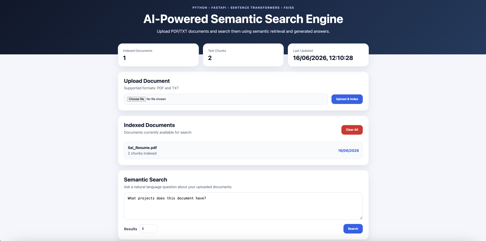
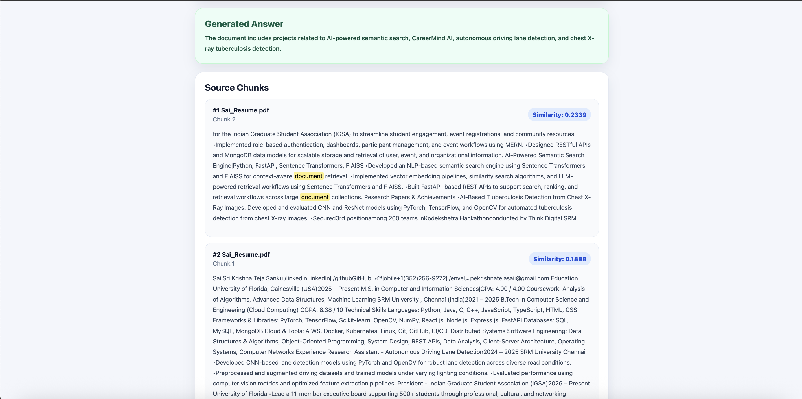

# AI-Powered Semantic Search Engine

A full-stack AI-powered semantic search application that enables users to upload PDF/TXT documents, retrieve relevant information using vector similarity search, and generate concise answers from retrieved context. The system leverages Sentence Transformers for semantic embeddings, FAISS for vector indexing, FastAPI for backend APIs, and React for the user interface.

---

## Live Demo

Frontend Deployment:

https://ai-semantic-search-engine-dusky.vercel.app

**Note:** The frontend is publicly deployed on Vercel. The backend utilizes transformer-based embedding models and FAISS indexing, which are demonstrated locally due to memory constraints on free hosting platforms.

---

## Demo Screenshots

### Dashboard



### Semantic Search Results



---

## Project Highlights

* AI-powered semantic document retrieval
* Vector search using FAISS indexing
* Sentence Transformer embeddings for contextual understanding
* PDF and TXT document ingestion pipeline
* Answer generation from retrieved document context
* FastAPI REST API backend
* Responsive React frontend dashboard
* End-to-end Retrieval-Augmented Search workflow

---

## Tech Stack

### Backend

* Python
* FastAPI
* Sentence Transformers
* FAISS
* PyPDF
* NumPy

### Frontend

* React
* Vite
* Axios
* CSS

---

## Features

* Upload PDF and TXT documents
* Automatic text extraction
* Intelligent document chunking
* Semantic embedding generation
* FAISS vector indexing
* Meaning-based document retrieval
* Generated answers from retrieved context
* Ranked search results with similarity scores
* Indexed document management
* Document statistics dashboard
* Interactive React user interface

---

## Project Architecture

```text
User Uploads Document
        ↓
FastAPI Backend
        ↓
Text Extraction
        ↓
Document Chunking
        ↓
Sentence Transformer Embeddings
        ↓
FAISS Vector Store
        ↓
Semantic Retrieval
        ↓
Answer Generation
        ↓
React Frontend
```

## Folder Structure

```text
ai-semantic-search-engine/
│
├── backend/
│   ├── app/
│   │   ├── document_loader.py
│   │   ├── embeddings.py
│   │   ├── main.py
│   │   ├── search.py
│   │   └── vector_store.py
│   │
│   └── requirements.txt
│
├── frontend/
│   ├── src/
│   │   ├── App.jsx
│   │   ├── App.css
│   │   └── main.jsx
│   │
│   └── package.json
│
├── screenshots/
│   ├── home.png
│   └── results.png
│
└── README.md
```

---

## How It Works

1. Users upload PDF or TXT documents.
2. The backend extracts raw document text.
3. Documents are divided into smaller semantic chunks.
4. Sentence Transformers generate vector embeddings.
5. Embeddings are indexed using FAISS.
6. Users submit natural language queries.
7. FAISS retrieves the most relevant document chunks.
8. Retrieved chunks are used to generate a concise answer.
9. Ranked source chunks and similarity scores are displayed.

---

## Running the Backend

```bash
cd backend

python3 -m venv venv

source venv/bin/activate

pip install -r requirements.txt

uvicorn app.main:app --reload
```

Backend URL:

```text
http://127.0.0.1:8000
```

API Documentation:

```text
http://127.0.0.1:8000/docs
```

---

## Running the Frontend

```bash
cd frontend

npm install

npm run dev
```

Frontend URL:

```text
http://localhost:5173
```

---

## API Endpoints

| Method | Endpoint   | Description                           |
| ------ | ---------- | ------------------------------------- |
| GET    | /          | Backend status                        |
| GET    | /health    | Health check                          |
| POST   | /upload    | Upload and index document             |
| POST   | /search    | Semantic search and answer generation |
| GET    | /documents | View indexed documents                |
| GET    | /stats     | View indexing statistics              |
| DELETE | /clear     | Clear indexed data                    |

---

## Resume Description

Built a full-stack AI-powered semantic search engine using FastAPI, React, Sentence Transformers, and FAISS to support meaning-based document retrieval, vector search, and answer generation from uploaded documents.

---

## Resume Bullet Points

* Developed a semantic document retrieval system supporting PDF/TXT ingestion and natural language search.
* Implemented document chunking, vector embedding generation, and FAISS-based similarity search for contextual information retrieval.
* Built FastAPI REST APIs and a React dashboard for document indexing, retrieval, answer generation, and search visualization.
* Designed an end-to-end Retrieval-Augmented Search pipeline using transformer embeddings and vector databases.

---

## Future Improvements

* LLM-powered answer generation using Gemini or OpenAI APIs
* Multi-document conversational chat interface
* User authentication and document management
* Docker and Kubernetes deployment
* Support for DOCX, PPTX, and XLSX files
* Search analytics and usage dashboard

---

## Author

**Sai Sri Krishna Teja Sanku**

GitHub: https://github.com/krishnatejasai
